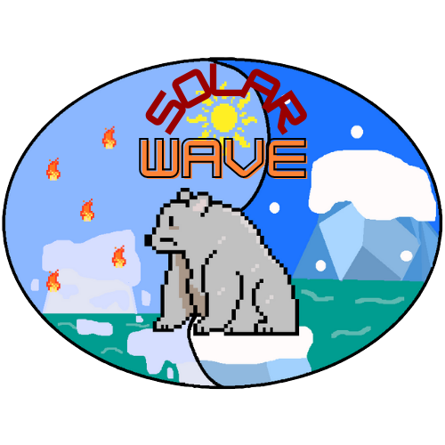
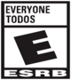
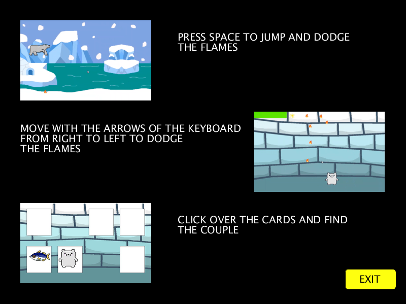
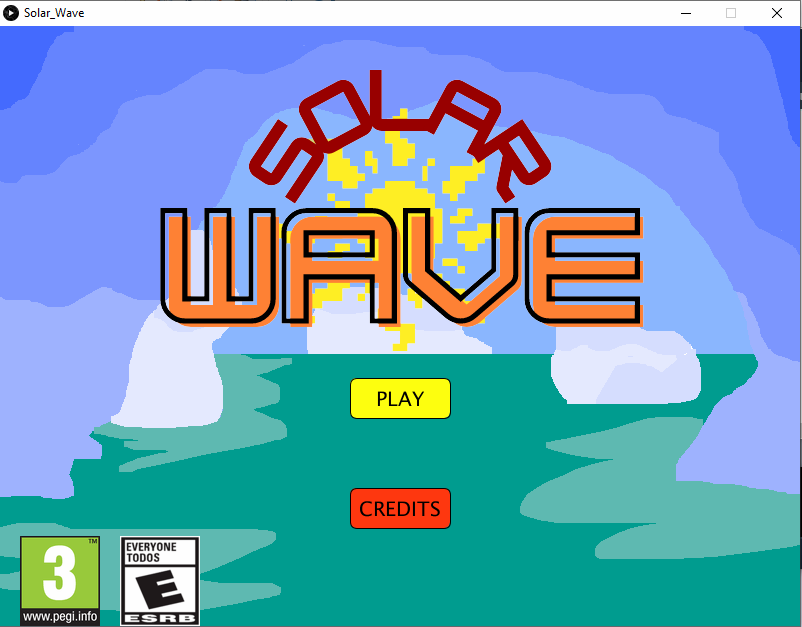
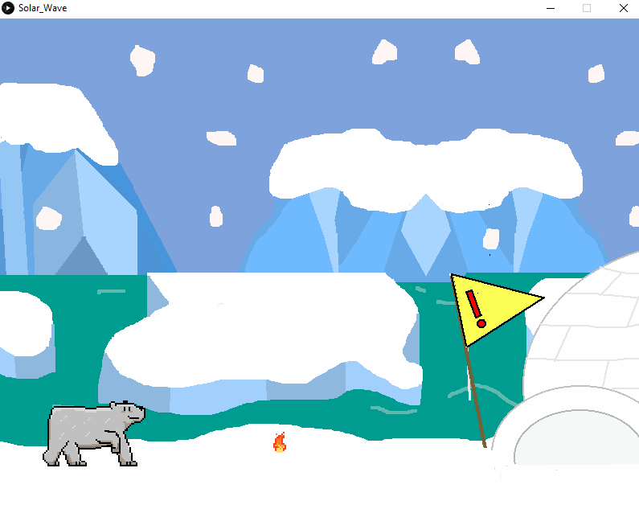
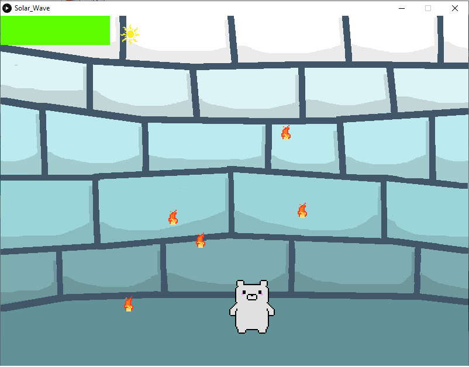
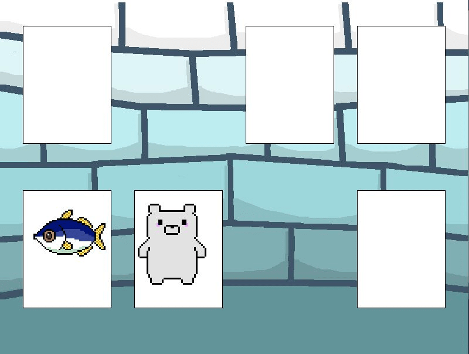

# Solar Wave
## Banner 

## Creators:

Ashely Amaya - 2192294

Karen Prada - 2192300

## Description:
The sun has reached the maximum point of ultraviolet radiation, causing serious damage such as the destruction of
habitats and species extinction, due to late reaction and lack of interest on the part of the breed
human. Paco, the polar bear, is one of the few survivors on the face of the earth, who finds a
map that will guide you to the only "safe place", for this you must avoid radiation (llamas) and face
different tests (minigames) until you reach your destination.
## Genre: 
Arcade 
## Age classification:
For everyone

## How to play:

## Features:
* All the images were made in piskel.
* When Paco enters the igloo the minigame starts.
* If you pass the minigame, you will earn a fish.
* The first minigame has a timer.
* In the second minigame you have to match all the cards.

## Trailer and GamPlay
https://www.youtube.com/watch?v=olcmyO09NjY&feature=youtu.be

## Gallery 
- Menu 

- Main game

- Mini-game 1

- Mini-game 2

## Requirements:
Download the 'minim' library to live the musical experience of the game.
* Open the project in Proccesing
* Sketch / Import Libraries / Add Library
* Type "Minim" in the search engine
* Install

## Credits
1. Programming orientation: Alex Mantilla (Programming tutor).
2. Musical content: Patrick de Arteaga https://patrickdearteaga.com/es/musica-libre-derechos-gratis/lista-completa/
